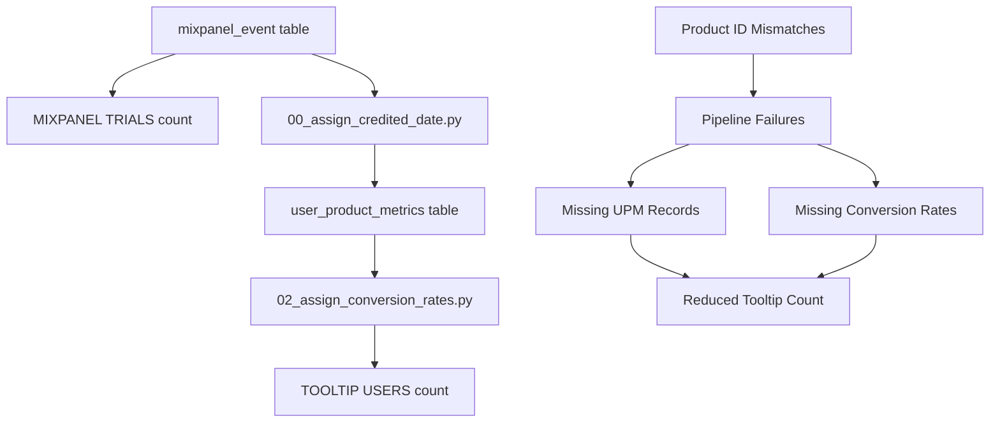

# Dashboard Trial Count Discrepancy Analysis

## Problem Statement

Users have reported a discrepancy between two metrics displayed on the dashboard:
1. **TRIALS (MIXPANEL)** column showing one count (e.g., 99 trials)
2. **Total Users** count in conversion rate tooltips showing a different count

This document provides a detailed root cause analysis of this discrepancy.

## Executive Summary

**Root Cause:** The two metrics use different data sources, date fields, and filtering criteria, leading to inconsistent user counts.

**Impact:** Users see conflicting data that undermines trust in the dashboard accuracy.

**Recommendation:** The MIXPANEL TRIALS count is more accurate for actual trial activity. The tooltip count is artificially reduced by data processing pipeline issues.

## Detailed Analysis

### 1. How MIXPANEL TRIALS Count is Calculated

**Location:** `orchestrator/dashboard/services/analytics_query_service.py:1187`

**Query Logic:**
```sql
SELECT 
    COUNT(DISTINCT CASE WHEN e.event_name = 'RC Trial started' AND DATE(e.event_time) BETWEEN ? AND ? THEN u.distinct_id END) as mixpanel_trials_started
FROM mixpanel_user u
LEFT JOIN mixpanel_event e ON u.distinct_id = e.distinct_id
WHERE u.abi_ad_id IN (...)
  AND u.has_abi_attribution = TRUE
GROUP BY u.abi_ad_id
```

**Characteristics:**
- **Primary Data Source:** `mixpanel_event` table
- **Date Filter:** `e.event_time BETWEEN start_date AND end_date`
- **Criteria:** Users who performed 'RC Trial started' events within date range
- **Count Method:** DISTINCT users with trial events

### 2. How Tooltip Total Users Count is Calculated

**Location:** `orchestrator/dashboard/services/analytics_query_service.py:2340`

**Query Logic:**
```sql
SELECT COUNT(*) as total_users
FROM user_product_metrics upm
JOIN mixpanel_user u ON upm.distinct_id = u.distinct_id
WHERE {entity_field} = ?
  AND upm.credited_date BETWEEN ? AND ?
  AND upm.trial_conversion_rate IS NOT NULL
  AND upm.trial_converted_to_refund_rate IS NOT NULL  
  AND upm.initial_purchase_to_refund_rate IS NOT NULL
  AND EXISTS (
      SELECT 1 FROM mixpanel_event e 
      WHERE e.distinct_id = upm.distinct_id 
      AND e.event_name = 'RC Trial started'
      AND DATE(e.event_time) BETWEEN ? AND ?
  )
```

**Characteristics:**
- **Primary Data Source:** `user_product_metrics` table
- **Date Filter:** `upm.credited_date BETWEEN start_date AND end_date`
- **Additional Filters:** Must have non-null conversion rates calculated
- **Verification:** Must also have trial events (EXISTS check)
- **Count Method:** Number of UPM records matching criteria

### 3. Key Differences Causing Discrepancy

#### A. Different Date Fields
- **MIXPANEL TRIALS:** Uses `event_time` (when trial event occurred)
- **TOOLTIP USERS:** Uses `credited_date` (when user gets attributed)

The `credited_date` is assigned by a preprocessing pipeline (`00_assign_credited_date.py`) and may not match the actual trial event date.

#### B. Different Data Sources
- **MIXPANEL TRIALS:** Direct count from event table
- **TOOLTIP USERS:** Processed data from analytics table

#### C. Additional Filtering Requirements
The tooltip query requires:
- User exists in `user_product_metrics` table
- Has calculated conversion rates (non-null values)
- Successfully processed through data pipeline

#### D. Data Pipeline Issues
From `pipelines/pre_processing_pipeline/00_assign_credited_date.py`:
```
# CRITICAL ISSUE: PRODUCT ID MISMATCHES
# - 380 users have starter events but 100% have mismatched product_ids
# - Examples: Event "gluten.free.eats.2.monthly" vs Metrics "glutenfree_map.CwX3l0tJjXE.12m"
```

### 4. Data Flow Dependencies



## Validation Through Testing

The debug script `debug_modal_and_discrepancy.py` reveals several potential issues:

1. **Users missing from UPM table:** Users with trial events not processed into `user_product_metrics`
2. **Missing conversion rates:** Users in UPM without calculated rates
3. **Date field mismatches:** `event_date ≠ credited_date` for many users
4. **Product ID mapping failures:** Preventing proper data processing

## Which Count is Correct?

### ✅ MIXPANEL TRIALS Count is More Accurate

**Reasons:**
- Directly reflects actual user behavior (trial events)
- Not dependent on downstream processing pipelines
- Uses original event timestamps
- Simpler, more reliable data path

### ❌ TOOLTIP USERS Count is Artificially Reduced

**Reasons:**
- Excludes users due to processing pipeline failures
- Requires successful completion of multiple pipeline steps
- Affected by product ID mapping issues
- Uses derived/processed data that may be incomplete

## Recommended Solutions

### Immediate Fixes

1. **Use Consistent Data Source**
   - Consider using `mixpanel_trials_started` count as the tooltip denominator
   - Or fix the UPM processing to include all trial users

2. **Fix Product ID Mapping**
   - Create mapping table for product ID variations
   - Implement fuzzy matching for related products (monthly/yearly variants)

3. **Data Quality Validation**
   - Add checks to ensure trial users get processed into UPM
   - Alert when significant discrepancies occur

### Long-term Improvements

1. **Consistent Date Field Usage**
   - Standardize on `event_time` for all trial-related calculations
   - Or ensure `credited_date` accurately reflects trial timing

2. **Pipeline Robustness**
   - Improve error handling in preprocessing pipelines
   - Add retry logic for failed processing

3. **Data Integrity Monitoring**
   - Regular audits comparing event counts vs UPM counts
   - Automated alerts for data quality issues

## Impact Assessment

- **Current State:** Confusing and inconsistent user experience
- **Trust Impact:** Users question dashboard accuracy
- **Analytical Impact:** Unclear which metric to use for decisions
- **Operational Impact:** Time spent investigating "bugs" that are actually data pipeline issues

## Conclusion

The discrepancy is not a bug in the dashboard display logic, but rather a symptom of data processing pipeline issues. The MIXPANEL TRIALS count should be considered the authoritative source for actual trial activity, while the tooltip count reflects processed/analyzed data that may be incomplete due to pipeline failures.

The most immediate solution is to acknowledge this discrepancy in the UI and potentially use the more reliable MIXPANEL TRIALS count for both displays until the underlying data pipeline issues can be resolved. 